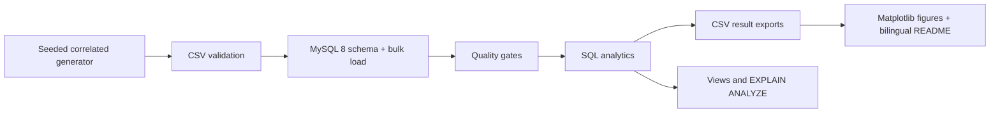
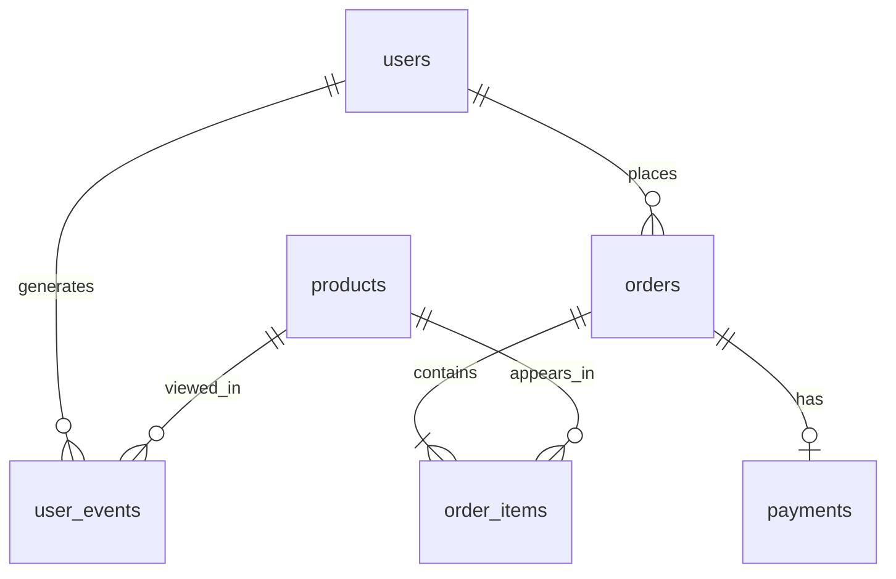

# MySQL E-commerce User Behavior Analytics

[English](README.md) | [中文](README_zh-CN.md)

> A SQL-first portfolio project that turns reproducible e-commerce events into decision-ready customer, funnel, retention, RFM, and product analytics in **MySQL 8**.

`MySQL 8` · `SQL` · `CTE` · `Window Functions` · `RFM` · `Conversion Funnel` · `Cohort Retention` · `Query Optimization` · `Python`


## Overview

This repository demonstrates an end-to-end analytics workflow: correlated synthetic data generation, relational modeling, constraints and indexes, bulk loading, data-quality gates, business SQL, result export, visualization, tests, and CI. Python only orchestrates, exports, and plots; all business metrics are calculated in MySQL.

## Business Problem

An e-commerce team needs consistent answers to four questions: where customers drop from view to payment, which acquisition channels and products create value, which cohorts return, and which customer groups deserve retention investment. Definitions are centralized in the SQL files to prevent conflicting KPI logic.

## Verified Results

All figures below were generated from the final MySQL 8.0.46 run with `--users 50000 --seed 42` (2025-01-01 to 2025-12-31).

| Metric | Result |
|---|---:|
| Users / Products | 50,000 / 1,500 |
| Events | 1,400,993 |
| Orders / Order items / Payments | 139,705 / 224,865 / 124,505 |
| Paid orders / Paying users | 117,593 / 21,364 |
| Revenue / AOV | 46,655,349.36 / 396.75 |
| Refund rate | 4.95% |
| Overall view-to-payment CVR | 43.57% |
| Repeat purchase rate | 83.50% |
| Average days to second purchase | 35.90 |
| Average cohort M1 / M2 / M3 | 56.79% / 57.50% / 57.53% |
| Top category | Electronics (21,441,390.67 revenue) |

The repeat rate is intentionally high because orders are concentrated among high-value and regular profiles; the full traffic base still contains many non-buyers. Synthetic findings demonstrate analytical technique and are not claims about a real company.

## Project Architecture



## Dataset and Database Schema

The generator models channel/profile purchase propensity, category price and margin differences, multi-event sessions, abandonment, cancellation, and refunds. Hidden generation profiles never replace SQL-derived RFM segments.




Money uses `DECIMAL(12,2)`, dates use `DATE`/`DATETIME`, and MySQL 8 `CHECK`, `FOREIGN KEY`, `UNIQUE`, `NOT NULL`, and primary-key constraints protect integrity. See [`sql/01_create_tables.sql`](sql/01_create_tables.sql).

## Data Quality

[`sql/03_data_quality.sql`](sql/03_data_quality.sql) checks duplicate keys, nulls, orphan users/products/orders/payments, pre-signup events, invalid money/quantity, refund-status conflicts, and order-to-item amount reconciliation. The final run returned **zero issues for every check**.

## Business KPI and Conversion Funnel

Revenue includes only `paid` and `completed` orders. GMV, revenue, paid orders, paying users, AOV, ARPU/ARPPU, paying rate, refund rate, and daily/monthly/channel breakdowns live in [`sql/04_basic_kpis.sql`](sql/04_basic_kpis.sql).


The funnel is user-level and deduplicated: a user counts once per stage during the analysis period. It permits valid skipped steps and does not mistake repeated events for additional users.


| Stage | Users | Step CVR |
|---|---:|---:|
| View | 49,496 | — |
| Add to cart | 23,599 | 47.68% |
| Purchase | 21,942 | 92.98% |
| Payment | 21,567 | 98.29% |


## User Behavior Analysis

`LEAD()` builds adjacent event transitions inside each session; conditional aggregation measures session engagement and payment conversion. See [`sql/06_user_behavior.sql`](sql/06_user_behavior.sql).


## RFM Segmentation

R, F, and M are derived only from successful orders. `NTILE(5)` assigns quintiles, reverses recency scoring, and maps scores to documented segments.


Champions are the largest revenue segment (4,222 users; 19,984,860.61 revenue). Full output: [`reports/tables/rfm_segments.csv`](reports/tables/rfm_segments.csv).

## Retention and Repeat Purchase

Monthly cohort retention is active users in an activity month divided by that registration cohort's initial users. M0 includes registration activity; M1+ measures return activity. [`sql/08_retention_repeat_purchase.sql`](sql/08_retention_repeat_purchase.sql) also uses `ROW_NUMBER()` and `LAG()` for first/second purchases and gaps. D1/D7/D30 can be derived with the same event-date convention.


## Product Analysis

Product and category SQL calculates buyers, units, revenue, cost-based gross profit/margin, and category Top-N. `DENSE_RANK() OVER (PARTITION BY category ORDER BY revenue DESC)` provides grouped rankings.


## Window Functions

Business uses are collected in [`sql/10_window_functions.sql`](sql/10_window_functions.sql): `ROW_NUMBER()` purchase order, `RANK()`/`DENSE_RANK()` product ranking, `LAG()` purchase gaps, `LEAD()` next behavior, `SUM() OVER()` cumulative/rolling revenue, `AVG() OVER()` moving average, and `NTILE()` RFM scoring.

```sql
WITH ranked AS (
  SELECT user_id, order_time,
         ROW_NUMBER() OVER (PARTITION BY user_id ORDER BY order_time) AS purchase_number,
         LAG(order_time) OVER (PARTITION BY user_id ORDER BY order_time) AS previous_order
  FROM orders WHERE order_status IN ('paid', 'completed')
)
SELECT * FROM ranked WHERE purchase_number = 2;
```

## Query Optimization

Composite indexes follow the leftmost-prefix rule and match common equality-plus-time-range access patterns: `user_events(user_id,event_time)`, `orders(user_id,order_time)`, and event/product/status variants. Actual `EXPLAIN` returned `type=range`, keys `idx_events_user_time` and `idx_orders_user_time`, with 16 and 1 estimated rows respectively—rather than full-table scans. No fabricated millisecond comparison is reported.


## Repository Structure

```text
src/                 generation, validation, MySQL load, export, visualization, pipeline
sql/                 schema, indexes, quality, KPIs, funnel, RFM, retention, views, EXPLAIN
reports/tables/      versioned SQL query results
reports/figures/     README-ready 180-DPI figures
notebooks/           display-only results notebook
tests/               data, metric, and optional MySQL integration tests
.github/workflows/   CI for database-independent tests
```

## Quick Start

```bash
python -m venv .venv
# Windows: .venv\Scripts\activate
pip install -r requirements.txt
copy .env.example .env
docker compose up -d
python -m src.pipeline --users 5000 --seed 42
pytest -q
```

For the portfolio-scale run use `python -m src.pipeline --users 50000 --seed 42`. Large raw CSV files and `.env` are intentionally ignored.

## MySQL and Docker Setup

The local demo maps MySQL 8 to port `3307`; credentials in Compose are explicitly demo-only. For an existing server, edit `.env`. The pipeline stops clearly on connection failure and never silently substitutes SQLite.

## Tests and Reproducibility

The final local run passed **6 tests**, including a live MySQL 8 connection test (`RUN_MYSQL_TESTS=1`). CI excludes only the integration-marked test. Seed 42, fixed 2025 dates, `pathlib`, pinned business definitions, and deterministic generation make results reproducible.

## Limitations and Future Work

This is synthetic data: channel effects and behavioral causality are illustrative, D1/D7/D30 queries can be exported alongside monthly cohorts, and execution timing varies by hardware/statistics. Future work could add scheduled snapshots and BI dashboards without moving SQL logic into pandas. Predictive ML is intentionally out of scope.

## Tech Stack and License

MySQL 8, SQL, Python 3.10+, pandas, NumPy, PyMySQL, SQLAlchemy, Matplotlib, pytest, Jupyter, Docker, GitHub Actions. Licensed under [MIT](LICENSE).

