# MySQL 电商用户行为数据分析

[English](README.md) | [中文](README_zh-CN.md)

> 一个以 SQL 为核心的求职作品集：在 **MySQL 8** 中把可复现电商行为数据转化为漏斗、留存、RFM、复购和商品分析结论。

`MySQL 8` · `SQL` · `CTE` · `窗口函数` · `RFM` · `转化漏斗` · `Cohort 留存` · `查询优化` · `Python`

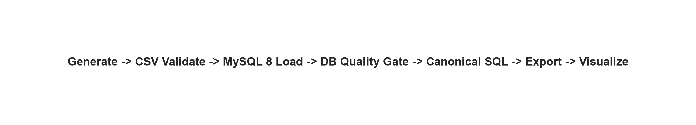

## 项目概览与业务问题

项目完整覆盖：关联模拟数据、关系建模、约束和索引、批量导入、数据质量门禁、业务 SQL、结果导出、可视化、测试与 CI。[`sql/11_views.sql`](sql/11_views.sql) 是可复用语义视图层，[`sql/analytics/`](sql/analytics/) 是规范分析与导出查询层。Python 不复制业务 SQL，只执行这些文件、导出结果和制图。GitHub Actions 会启动真实 MySQL 8 服务并运行完整链路。

业务目标是统一回答：用户在哪个漏斗步骤流失、哪些渠道和商品创造价值、哪些 Cohort 持续活跃、哪些客户群值得重点运营。所有指标口径集中在 SQL 中，避免重复分析出现冲突。

## 实际验收结果

以下数字全部来自 MySQL 8.0.46 最终实跑：`--users 50000 --seed 42`，日期范围为 2025-01-01 至 2025-12-31。

| 指标 | 结果 |
|---|---:|
| 用户 / 商品 | 50,000 / 1,500 |
| 行为事件 | 1,400,993 |
| 订单 / 明细 / 支付 | 139,705 / 224,865 / 124,505 |
| 成功订单 / 付费用户 | 117,593 / 21,364 |
| 收入 / 客单价 | 46,655,349.36 / 396.75 |
| 退款率 | 4.95% |
| Reach / 严格时序总体转化 | 43.57% / 41.76% |
| 复购率 | 83.50% |
| 平均第二次购买间隔 | 35.90 天 |
| Cohort 平均 M1 / M2 / M3 | 56.79% / 57.50% / 57.53% |
| 收入最高品类 | Electronics（可对账收入 21,428,707.38） |

复购率较高是因为生成逻辑把订单集中在高价值和常规用户，而总体流量仍包含大量不购买用户。所有结论仅用于展示分析能力，不代表真实企业表现。

## 项目架构

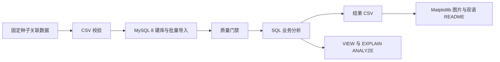

## 数据集与数据库结构

生成器体现渠道/用户类型购买倾向、品类价格与毛利差异、多事件 Session、弃购、取消和退款。内部用户类型只用于生成，最终 RFM 完全由 SQL 重新计算。

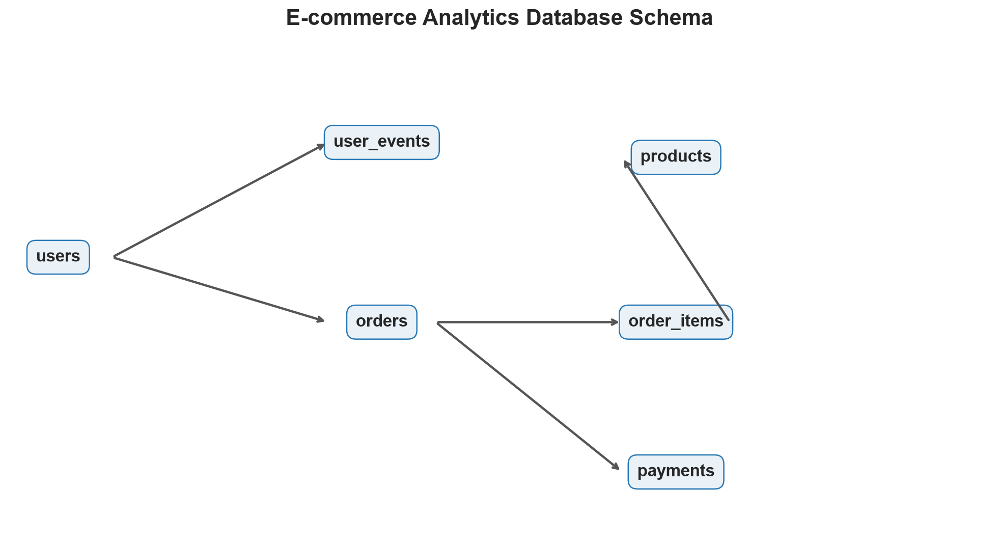

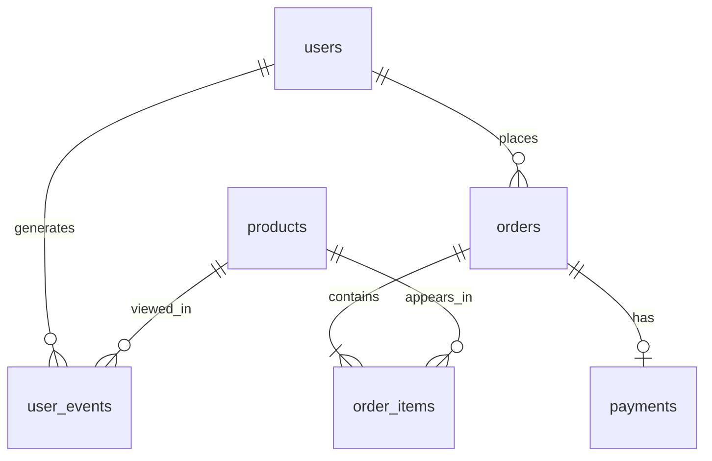

金额采用 `DECIMAL(12,2)`，日期使用 `DATE/DATETIME`；主键、外键、唯一、非空和 MySQL 8 `CHECK` 约束见 [`sql/01_create_tables.sql`](sql/01_create_tables.sql)。

## 数据质量

[`sql/03_data_quality.sql`](sql/03_data_quality.sql) 检查主键重复、NULL、孤立外键、注册前事件、数据集截止时间、非法金额/数量、退款状态冲突、订单明细金额，以及商品与订单收入对账。它是阻塞式 Pipeline 门禁：任一异常非零，分析和制图立即停止。最终 **14 项检查全部为 0**。

## 核心 KPI 与转化漏斗

Revenue 只统计 `paid/completed` 订单。可复用定义位于语义 VIEW，规范导出查询位于 [`sql/analytics/`](sql/analytics/)；导出器只保存 SQL 文件名，不再复制业务 SQL 字符串。

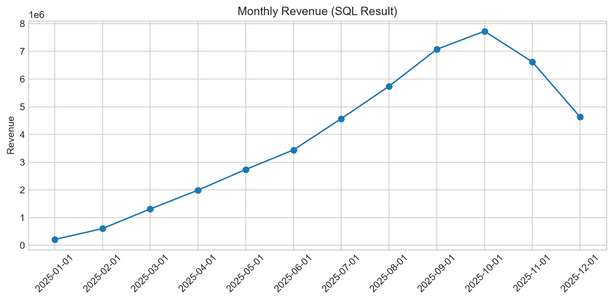

Reach 漏斗按用户去重，表示分析期内是否到达过阶段；严格时序漏斗额外要求 `view_time <= cart_time <= purchase_time <= payment_time`。两种口径并存，明确展示事件顺序对转化定义的影响。

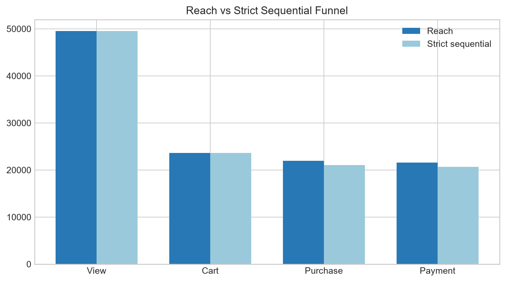

| 阶段 | 用户数 | 单步转化率 |
|---|---:|---:|
| 浏览 | 49,496 | — |
| 加购 | 23,599 | 47.68% |
| 购买 | 21,942 | 92.98% |
| 支付 | 21,567 | 98.29% |

严格时序结果为：浏览 49,496、加购 23,599、购买 21,008、支付 20,668，总体转化率 41.76%。对应 SQL：[`conversion_funnel.sql`](sql/analytics/conversion_funnel.sql) 与 [`strict_conversion_funnel.sql`](sql/analytics/strict_conversion_funnel.sql)。

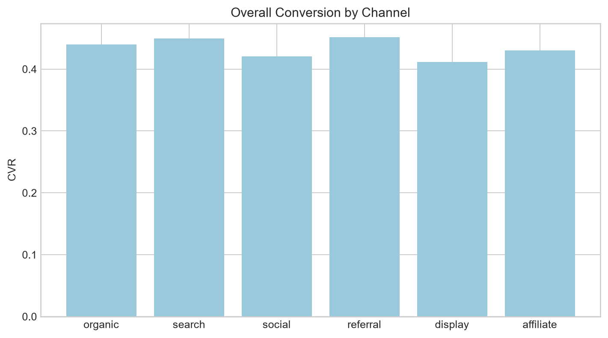

## 行为路径分析

使用 `LEAD()` 按 Session 构造相邻行为转移，详见 [`behavior_transitions.sql`](sql/analytics/behavior_transitions.sql)。

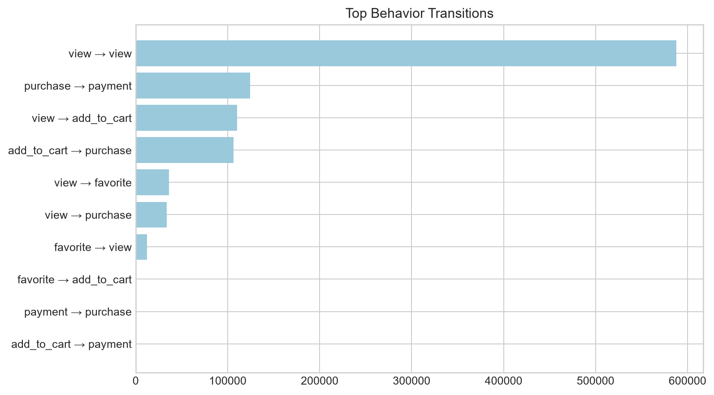

## RFM 用户分层

R/F/M 只基于成功订单；`NTILE(5)` 分位打分，并对 Recency 反向赋分，再映射为业务分层。

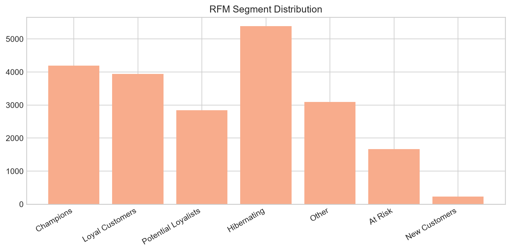
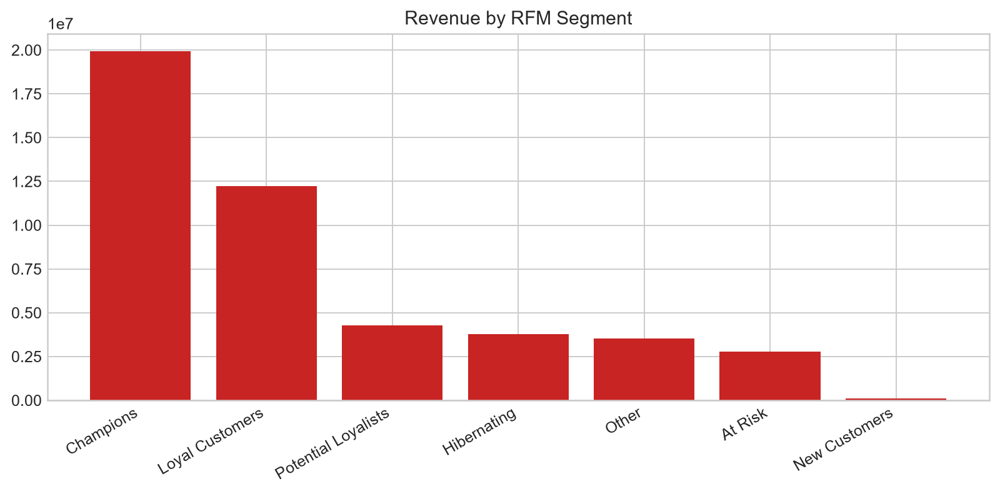

Champions 是收入最高分层：4,196 人、收入 19,928,686.82。所有 RFM `NTILE(5)` 都以 `user_id` 稳定打破并列。完整结果见 [`reports/tables/rfm_segments.csv`](reports/tables/rfm_segments.csv)。

## 留存与复购

月度 Cohort 定义：注册月为 `cohort_month`，事件发生月为 `activity_month`，当月活跃人数除以 Cohort 初始人数。M0 含注册行为，M1+ 衡量回访。复购分析使用 `ROW_NUMBER()` 和 `LAG()` 识别首次/二次购买及间隔。

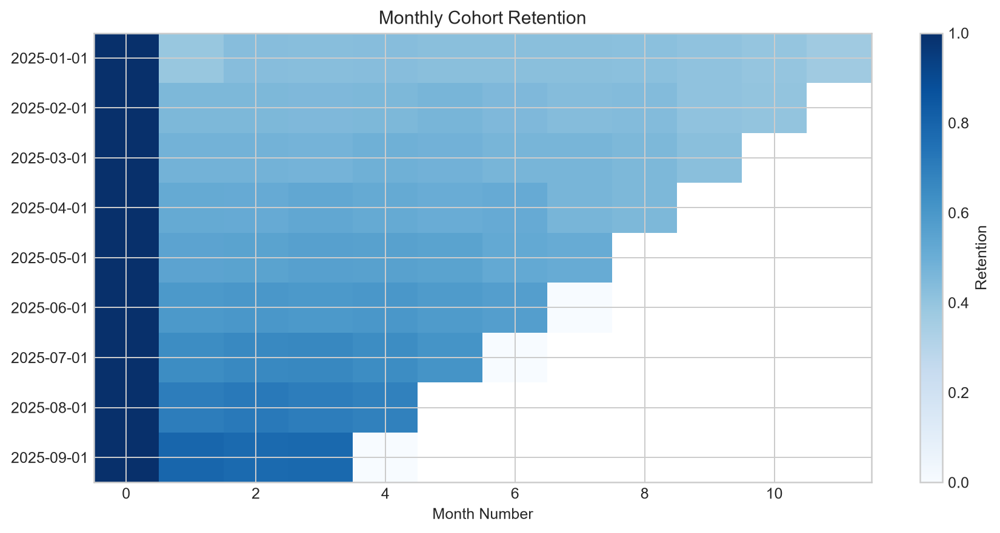
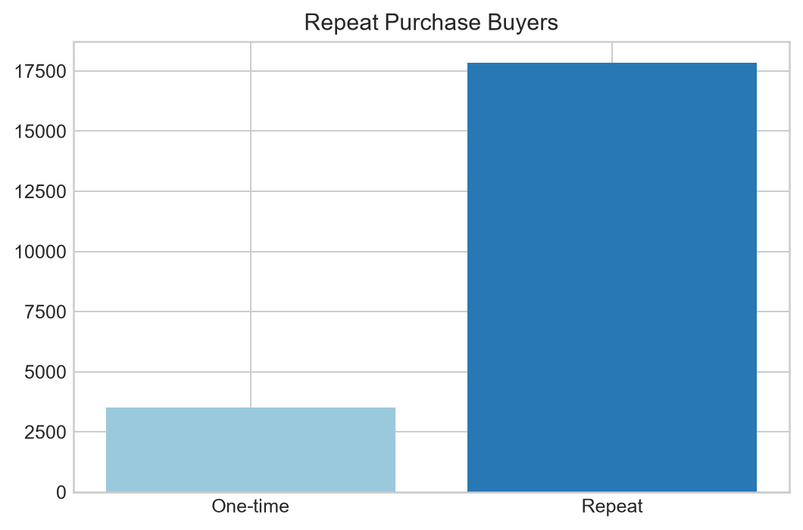

## 商品分析

商品分析区分 `item_net_sales`（扣除明细级优惠后的商品金额）与可对账 `revenue`。订单级优惠和运费按明细净额比例分摊，分摊到分后产生的尾差固定归入最小 `order_item_id`，因此商品 Revenue 能以分为精度与成功订单 `total_amount` 严格对账。在此基础上计算成本、毛利、毛利率、买家数、销量和品类 Top-N。`DENSE_RANK() OVER(PARTITION BY category ORDER BY revenue DESC)` 保留真正的并列排名，`product_id` 只用于最终稳定展示排序。

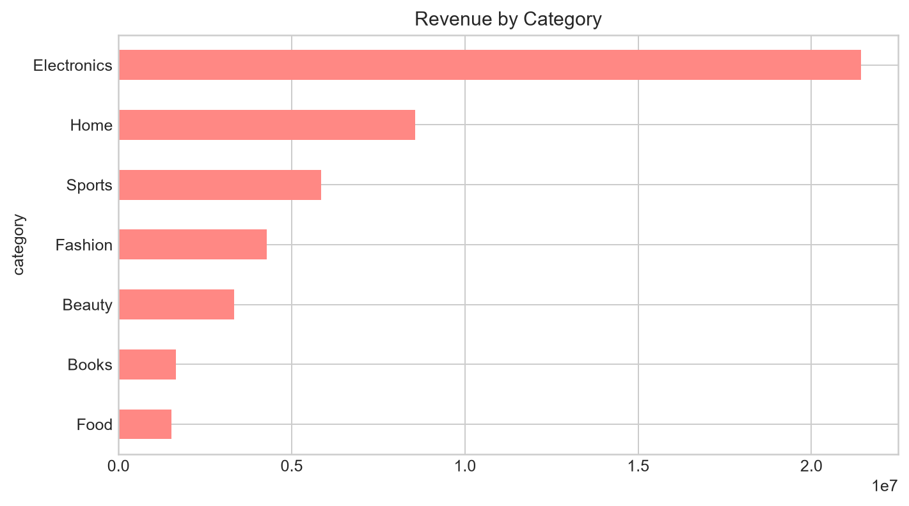
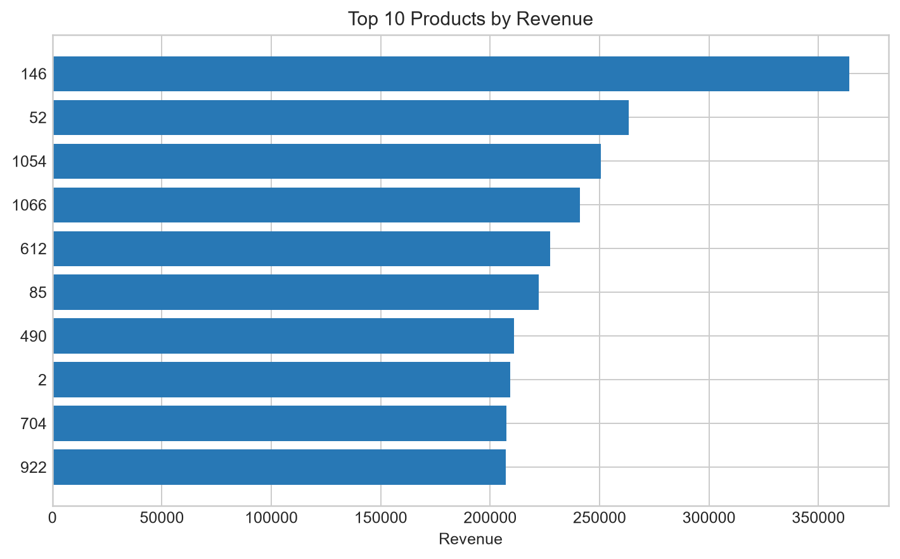

## 窗口函数

窗口函数位于对应的唯一业务查询中：[`repeat_purchase.sql`](sql/analytics/repeat_purchase.sql) 使用 `ROW_NUMBER/LAG`，[`product_performance.sql`](sql/analytics/product_performance.sql) 使用 `DENSE_RANK`，[`behavior_transitions.sql`](sql/analytics/behavior_transitions.sql) 使用 `LEAD`，RFM VIEW 使用确定性的 `NTILE`。

```sql
SELECT user_id, order_time,
       ROW_NUMBER() OVER (PARTITION BY user_id ORDER BY order_time) AS purchase_number,
       LAG(order_time) OVER (PARTITION BY user_id ORDER BY order_time) AS previous_order
FROM orders
WHERE order_status IN ('paid', 'completed');
```

## 查询优化

复合索引遵循最左前缀原则，匹配“等值用户/状态 + 时间范围”查询。最终 `EXPLAIN` 中两条查询均为 `type=range`，命中 `idx_events_user_time` 与 `idx_orders_user_time`，预计扫描 23 行和 1 行，而非全表扫描。未编造毫秒级耗时。

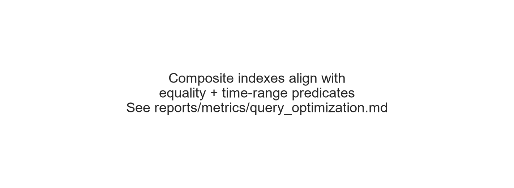

## 目录结构

```text
src/               生成、校验、MySQL 导入、导出、制图、Pipeline
sql/11_views.sql   可复用语义视图层
sql/analytics/     规范分析与导出查询层
sql/*.sql          建表、索引、阻塞式质量门禁、EXPLAIN
reports/tables/    可提交的 SQL 查询结果
reports/figures/   180 DPI README 图片
notebooks/         只展示结果的 Notebook
tests/             数据、业务指标、MySQL 集成测试
.github/workflows/ MySQL 8 全链路 CI
```

## 快速开始与 MySQL/Docker

```bash
python -m venv .venv
# Windows: .venv\Scripts\activate
pip install -r requirements.txt
copy .env.example .env
docker compose up -d
python -m src.pipeline --users 5000 --seed 42
pytest -q
```

作品集正式规模：`python -m src.pipeline --users 50000 --seed 42`。Docker 把 MySQL 8 映射到 `3307`；Compose 密码仅为本地 Demo。使用现有服务器时修改 `.env`。连接失败会明确停止，绝不偷偷改用 SQLite。

## 测试、复现与限制

最终本地测试 **12 passed**。集成测试验证 MySQL 8、表、外键、VIEW、非空数据、14 项质量门禁、KPI、Reach/严格漏斗、RFM、商品字段，以及商品收入与成功订单收入的精确对账。CI 生成 1,000 用户并真正完成建库、导入、门禁、分析和测试。测试数据使用临时目录，不会覆盖正式 CSV。

项目使用模拟数据，渠道效果和因果关系仅为展示；执行耗时依赖硬件和统计信息。未来可增加定时快照和 BI Dashboard，但不把 SQL 核心分析迁移到 pandas。预测型机器学习刻意不在范围内。

## 技术栈与许可证

MySQL 8、SQL、Python 3.10+、pandas、NumPy、PyMySQL、SQLAlchemy、Matplotlib、pytest、Jupyter、Docker、GitHub Actions。采用 [MIT License](LICENSE)。
